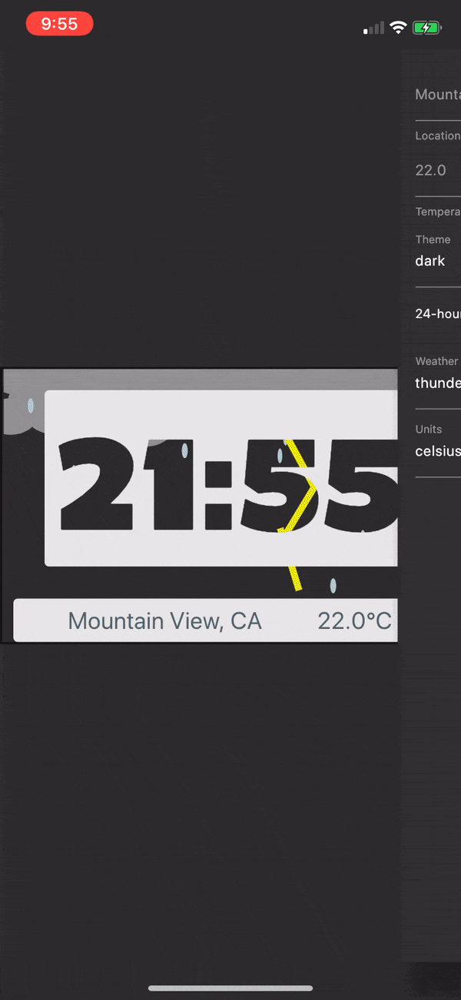

# The Weather Clock 

### This is Trenton and Miciah Baldrey's submission for the [Flutter Clock competition](https://flutter.dev/clock) put on by Google!

Our clock was intended as a 'window' to the weather of the outside world. We included different animated faces for each weather type. (our favorite is thunderstorm in dark mode)

We animated this using [Rive](https://rive.app/explore), which is an incredible tool that helps you create beautiful animations that can be exported and used with Flutter!

If you have any questions, let us know! We're pretty excited about the cool stuff you can do in Flutter.
